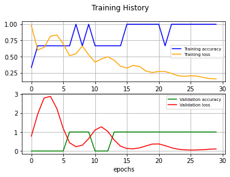
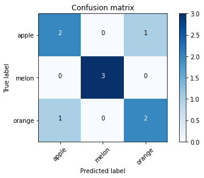

# imagepreprocessing
##### A small library for speeding up the dataset preparation and model testing steps for deep learning on various frameworks. (mostly for me)
___

[](https://pypi.python.org/pypi/imagepreprocessing/) [](https://pypi.python.org/pypi/imagepreprocessing/) [](https://pepy.tech/project/imagepreprocessing)
 [](https://github.com/cccaaannn/imagepreprocessing/blob/master/LICENSE)

## What can it do
- **Creates all the required files for [darknet-yolo3,4](https://github.com/AlexeyAB/darknet) training including cfg file with default parameters and class calculations in a single line. ([example usage](#Create-required-files-for-training-on-darknet-yolo ))**
- **Creates train ready data for image classification tasks for keras in a single line. ([example usage](#Create-training-data-for-keras))**
- **Makes multiple image prediction process easier with using keras model from both array and directory.([example usage](#Predict-all-images-in-a-directory-with-keras-model))**
- **Predicts and saves multiple images from a directory with using darknet. ([example usage](#Predict-all-images-in-a-directory-with-yolo-model))**
- **Includes a simple annotation tool for darknet-yolo style annotation. ([example usage](#Annotation-tool-for-derknet-yolo))**
- **Auto annotation by given random points for yolo. ([example usage](#Create-required-files-for-training-on-darknet-yolo-and-auto-annotate-images-by-center ))**
- **Draws bounding boxes of the images from annotation files for preview.**
- **Plots training history graph from keras history object. ([example usage](#Create-training-history-graph-for-keras))**
- **Plots confusion matrix. ([example usage](#Make-prediction-from-test-array-and-create-the-confusion-matrix-with-keras-model))**
- **([More](#Delete-a-class-and-update-all-yolo-annotation-files-in-a-directory))**

### This dataset structure is required for most of the operations 
```
my_dataset
   |----class1
   |     |---image1.jpg
   |     |---image2.jpg
   |     |---image3.jpg
   |     ...
   |----class2
   |----class3
         ...
```

## Install
```sh
pip install imagepreprocessing
```

## Create required files for training on darknet-yolo  
```python
from imagepreprocessing.darknet_functions import create_training_data_yolo
main_dir = "datasets/food_5class"
create_training_data_yolo(main_dir)

# other options
# create_training_data_yolo(main_dir, yolo_version=4, train_machine_path_sep = "/", percent_to_use = 1, validation_split = 0.2, create_cfg_file = True)
```
output
```
File name: apple - 1/5  Image:10/10
File name: melon - 2/5  Image:10/10
File name: orange - 3/5  Image:10/10
File name: beef - 4/5  Image:10/10
File name: bread - 5/5  Image:10/10

file saved -> yolo-custom.cfg
file saved -> train.txt
file saved -> test.txt
file saved -> obj.names
file saved -> obj.data

Download darknet53.conv.74 and move it to darknets root directory.(there are download links on https://github.com/AlexeyAB/darknet)
Also move your dataset file to darknet/data/food_5class
Run the command below in the darknets root directory to start training.
Your train command with map is: ./darknet detector train data/food_5class/obj.data data/food_5class/yolo-custom.cfg darknet53.conv.74 -map
Your train command for multi gpu is: ./darknet detector train data/food_5class/obj.data data/food_5class/yolo-custom.cfg darknet53.conv.74 -gpus 0,1 -map
```

## Create training data for keras
```python
from  imagepreprocessing.keras_functions import create_training_data_keras
source_path = "datasets/my_dataset"
train_x, train_y = create_training_data_keras(source_path)

# other options
# train_x, train_y, valid_x, valid_y = create_training_data_keras(source_path, save_path = "5000images_on_one_file", image_size = (299,299), validation_split=0.1, percent_to_use=0.5, grayscale = True)
```


## Predict all images in a directory with keras model
```python
from  imagepreprocessing.keras_functions import make_prediction_from_directory_keras

images_path = "datasets/my_dataset/class1"

# give the path
model = "model.h5"

# or model itself
# model.fit(...)

# predict
predictions = make_prediction_from_array_keras(images_path, model, image_size = (224,224), print_output=True, show_images=True)
```


## Create training history graph for keras
```python
from  imagepreprocessing.keras_functions import create_history_graph_keras

# training
# history = model.fit(...)

create_history_graph_keras(history)
```



## Make prediction from test array and create the confusion matrix with keras model
```python
from  imagepreprocessing.keras_functions import create_training_data_keras, make_prediction_from_array_keras
from  imagepreprocessing.utilities import create_confusion_matrix, train_test_split

images_path = "datasets/my_dataset"

# Create training data split the data
x, y, x_val, y_val = create_training_data_keras(images_path, save_path = None, validation_split=0.2, percent_to_use=0.5)

# split training data
x, y, test_x, test_y =  train_test_split(x,y,save_path = save_path)

# ...
# training
# ...

class_names = ["apple", "melon", "orange"]

# make prediction
predictions = make_prediction_from_array_keras(test_x, model, print_output=False)

# create confusion matrix
create_confusion_matrix(predictions, test_y, class_names=class_names, one_hot=True)
create_confusion_matrix(predictions, test_y, class_names=class_names, one_hot=True, cmap_color="Blues")
```



## Annotation tool for derknet-yolo
```python
from imagepreprocessing.darknet_functions import yolo_annotation_tool
yolo_annotation_tool("test_stuff/images", "test_stuff/obj.names")
```


## Predict all images in a directory with yolo model 
##### This function uses shell commands to run darknet so you don't need to compile it as .so file but it is also slow because of that.
```python
from imagepreprocessing.darknet_functions import make_prediction_from_directory_yolo

images_path = "datasets/my_dataset/class1"
darknet_path = "home/user/darknet"
save_path = "detection_results"

# your command has to have {0} on the position of image path
darknet_command = "./darknet detector test cfg/coco.data cfg/yolov3.cfg yolov3.weights {0} -dont_show"

make_prediction_from_directory_yolo(images_path, darknet_path, save_path=save_path, darknet_command=darknet_command)
```


## Create required files for training on darknet-yolo and auto annotate images by center 
##### Auto annotation is for testing the dataset or just for using it for classification, detection won't work without proper annotations.
```python
from imagepreprocessing.darknet_functions import create_training_data_yolo, auto_annotation_by_random_points
import os

main_dir = "datasets/my_dataset"

# auto annotating all images by their center points (x,y,w,h)
folders = sorted(os.listdir(main_dir))
for index, folder in enumerate(folders):
    auto_annotation_by_random_points(os.path.join(main_dir, folder), index, annotation_points=((0.5,0.5), (0.5,0.5), (1.0,1.0), (1.0,1.0)))

# creating required files
create_training_data_yolo(main_dir)
```

## Delete a class and update all yolo annotation files in a directory
```python
# function saves new annotation files on a different directory by default but you can pass the same directory to override old ones

# single directory
class_path = "datasets/my_dataset/class1"
remove_index = 2
remove_class_from_annotation_files(class_path, remove_index, new_annotations_path = "new_annotations")

# for multiple directories
import os
for path in os.listdir("datasets/my_dataset"):
    remove_class_from_annotation_files(path, remove_index, new_annotations_path = path + "_new")
```

## Count class appearances in a directory for annotated yolo data
```python
class_path = "datasets/my_dataset/class1"
names_path = "datasets/my_dataset/obj.names"
classes = count_classes_from_annotation_files(class_path, names_path, include_zeros=True)
print(classes)
```
output
```
{'apple': 3, 'melon': 2, 'orange': 0}
```


## Make multi input model prediction and create the confusion matrix
```python
from imagepreprocessing.keras_functions import create_training_data_keras
from  imagepreprocessing.utilities import create_confusion_matrix, train_test_split
import numpy as np

# Create training data split the data and split the data
source_path = "datasets/my_dataset"
x, y = create_training_data_keras(source_path, image_size=(28,28), validation_split=0, percent_to_use=1, grayscale=True, convert_array_and_reshape=False)
x, y, test_x, test_y = train_test_split(x,y)

# prepare the data for multi input training and testing
x1 = np.array(x).reshape(-1,28,28,1)
x2 = np.array(x).reshape(-1,28,28)
y = np.array(y)
x = [x1, x2]

test_x1 = np.array(test_x).reshape(-1,28,28,1)
test_x2 = np.array(test_x).reshape(-1,28,28)
test_y = np.array(test_y)
test_x = [test_x1, test_x2]

# ...
# training
# ...

# make prediction
predictions = make_prediction_from_array_keras(test_x, model, print_output=False, model_summary=False, show_images=False)

# create confusion matrix
create_confusion_matrix(predictions, test_y, class_names=["0","1","2","3","4","5","6","7","8","9"], one_hot=True)

```